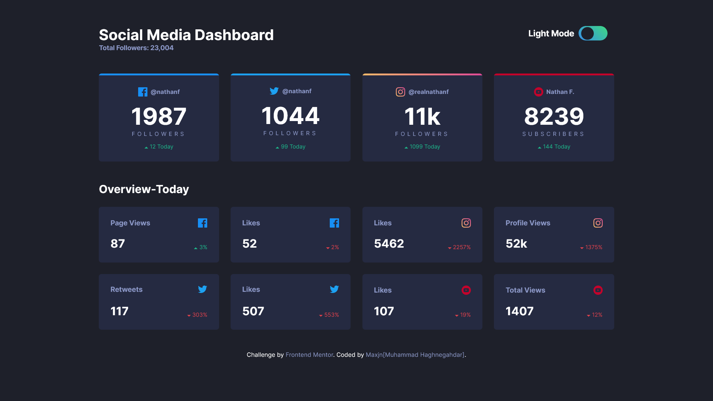
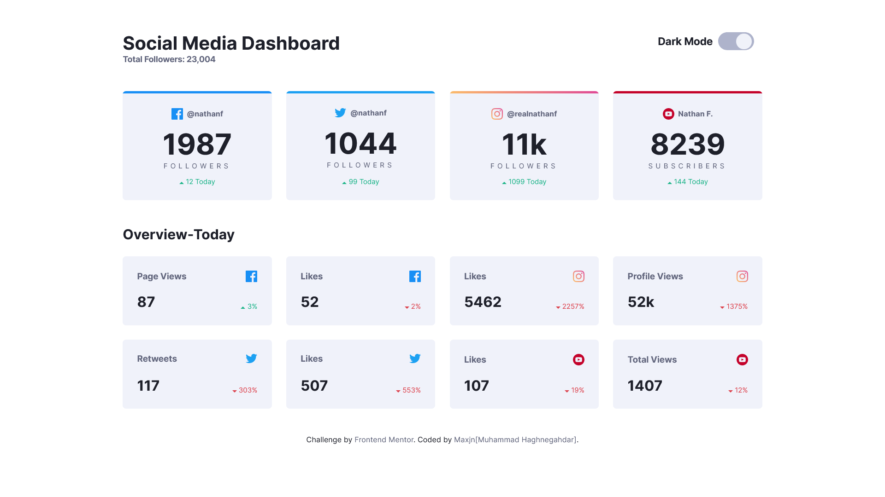

### Social media dashboard with theme switcher

Chech out live website [here](https://maxjn-dashboardtemplate.pages.dev).
This is my solution to the [Social media dashboard with theme switcher challenge on Frontend Mentor](https://www.frontendmentor.io/challenges/social-media-dashboard-with-theme-switcher-6oY8ozp_H). (:

###### Technologies

- HTML,Css
- javascript
- Sass
- Gulp
- Packages...

###### Features

- fully responsive
- Dark / Light mode toggle

###### Image

- Dark Mode
  
- Light Mode
  
